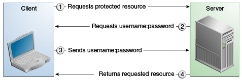

# Basic HTTP-authentication

Grundlæggende godkendelse er standard, når du ikke specificerer en godkendelsesmekanisme.  

Basic authentication ligner standardmetoden med brugernavn / adgangskode, hvor vi bruger et brugernavn og en adgangskode til at godkende API'et. Her en Base64-kodet streng, der indeholder brugernavnet og adgangskoden sendt til klienten. Base-64-kodning er ikke en krypteringsmetode, bare en måde at tage binære data på og omdanne dem til tekst, så de let kan overføres.  

Specificering af basic HTTP-authentication kræver, at serveren anmoder om et brugernavn og adgangskode fra webklienten og kontrollerer, at brugernavnet og adgangskoden er gyldig ved at sammenligne dem med en database med autoriserede brugere i den specificerede eller standardreal.  

HTTPS Basic passer godt til et relativt uvigtig internt API, som kræver blot en simpel autentificering, men manglen på krypteringsdel gør det til et dårligt valg for API'er med følsomme data, da der er stor chance for eksponering i tilfælde af MITM (Man in Mellemangrebet).

**Fordele**

  *  Implementering er temmelig enkel, da der ikke er nogen kryptering involveret
  *  Brug relativt mindre tid på at svare, da det kun har et enkelt opkald
  *  Manglen på token-oprettelse og krypteringsmetode giver klienten en fordel ved at bruge mindre kode til at kalde API
  *  Oplysningerne hentes fra serveren med kun et opkald, hvilket gør dem hurtigere end andre komplekse godkendelser

**Ulemper**

  *  SSL tager tid at køre grundlæggende HTTP, så dette vil gøre svartiden betydeligt langsom
  *  Manglen på kryptering gør sikkerhedsrisikoen temmelig høj. Sikkerhedsproblemer skyldes overvejende brugen af Basic-autorisation uden SSL, i hvilket tilfælde brugernavnet og adgangskoden udsættes for en MITM.
  *  I en browser er der også problemer med udløb af legitimationsoplysninger, men dette er ikke så meget af et problem for REST-tjenester.  
 

Når der bruges grundlæggende godkendelse, foregår følgende handlinger.

  * En klient anmoder om adgang til en beskyttet ressource.
  * Webserveren returnerer en dialogboks, der anmoder om brugernavn og adgangskode.
  * Klienten sender brugernavnet og adgangskoden til serveren.
  * Serveren autentificerer brugeren i den specificerede verden og returnerer den ønskede ressource, hvis den er vellykket.

  

