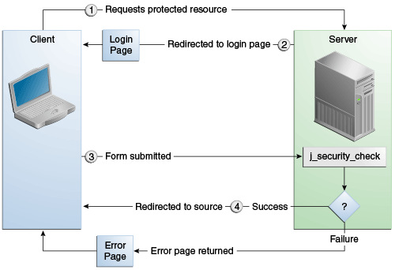

# Form-based authentication

Hoved funktionen ved FBA er dens evne til at autentificere sig imod forskellige brugere og roller.  

Tillader udvikleren at kontrollere udseendet og følelsen af login-godkendelsesskærmbillederne ved at tilpasse login-skærmen og fejlsiderne, som en HTTP-browser præsenterer for slutbrugeren.

Når form-baseret godkendelse er erklæret, forekommer følgende handlinger.

**Usecase**

**Fordele**

**Ulemper**

l
