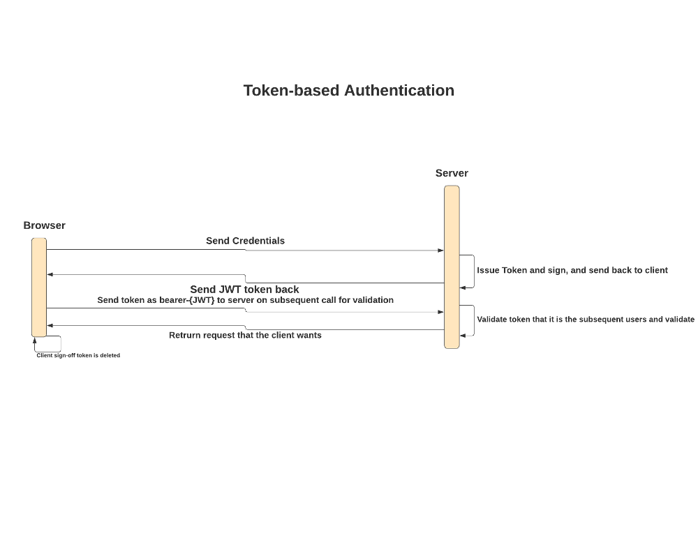

# Token-based Authentication

Når vi taler om token-baseret autentificering, henviser vi ofte til JWT (JSON Web Token), fordi det er blevet brugt meget i alle brancher og er blevet en de-facto standard til godkendelse.  
JWT er en åben standard, der definerer en kompakt, sikker og selvstændig måde at transmittere data mellem parter i JSON.    
JWT er en statsløs type godkendelse. Det betyder, at serveren ikke gemmer nogen sessioninformation i databasen. Det behøver ikke at føre en fortegnelse over, hvilken bruger der er logget ind, eller hvilken token der er udstedt for hvilken bruger. I stedet sender klienten efterfølgende anmodninger til serveren med en header i form af bærer- {JWT-token}, eller oftere sender klienten den i kroppen af en POST-anmodning eller som en URL-parameter.  

JWT'er består af tre dele adskilt med prikker (.), Som er:

    **Header** - Headeren består typisk af to dele: typen af ​​token, som er JWT, og den signeringsalgoritme, der bruges, såsom HMAC SHA256 eller RSA.
    For eksempel:

> {  
  "alg": "HS256",  
  "typ": "JWT"  
}  

Derefter er denne JSON Base64Url kodet til at danne den første del af JWT. Har forklaret Base64Url-kodning nedenfor.  

    **Payload** - Dette indeholder kravene. De data, vi ønsker. Et eksempel på payload kan være:  

>{  
  "sub": "1234567890",  
  "name": "John Doe",  
  "admin": sandt  
}

Nyttelasten kodes derefter Base64Url for at danne den anden del af JSON Web-token. Dette kan læses af alle som det lige er kodet. Det er ikke krypteret. Kodning er bare konvertering fra den ene form til den anden. Så undgå at bruge følsomme data som Aadhaar-nummer her.  

    **Signatur** - For at oprette signaturdelen skal du tage den kodede header, den kodede nyttelast, en hemmelighed, den algoritme, der er angivet i overskriften, og underskrive den.  
    
    Hvis du f.eks. Vil bruge HMAC SHA256-algoritmen, oprettes signaturen på følgende måde:  
    
    
> HMACSHA256 (  
  base64UrlEncode (header) + "." +  
  base64UrlEncode (nyttelast),  
  hemmelighed)  

Signaturen bruges til at bekræfte, at meddelelsen ikke blev ændret undervejs, og i tilfælde af tegn, der er underskrevet med en privat nøgle, kan den også bekræfte, at afsenderen af ​​JWT er den, den siger, den er.

Når vi modtager tokenet, er det første, vi gør, at verificere signaturen. Vi afkoder overskriften og nyttelasten og foretager derefter denne signatur med vores hemmelighed som med ovenstående algoritme. Hvis de matcher, er det en underskrevet JWT.

Derfor ser en JWT typisk ud som følgende.
xxxxx.yyyyy.zzzzz

**Fordele**  

 * De er state-less. Man behøver ikke at gemme i en session ID.
 * JSON Web Tokens er letvægt og kan let bruges på tværs af platforme og sprog. De er en smart måde at autentificere og autorisere uden sessioner.

**Ulemper** 

 * JWT'er kan være store (payload) i forhold til en sessions ID, Men de involverer ikke nogen handling med lagring af værdier på serveren.  
 * Når en token er udleveret, hvordan trækker man dem tilbage. Token levetid. Hvis der ikke er levetid på token, så vil den virke altid. Så skal man holde øje med hvilke tokens der er givet ud og så er det ikke stateless mere

  